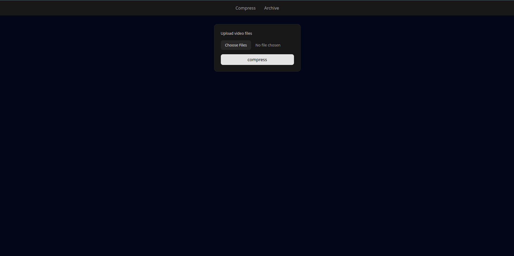
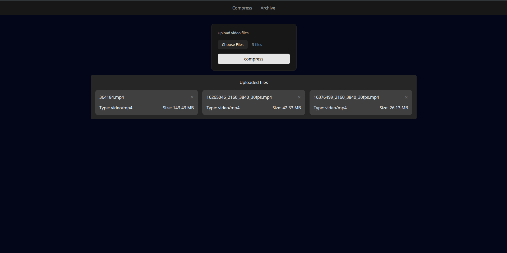
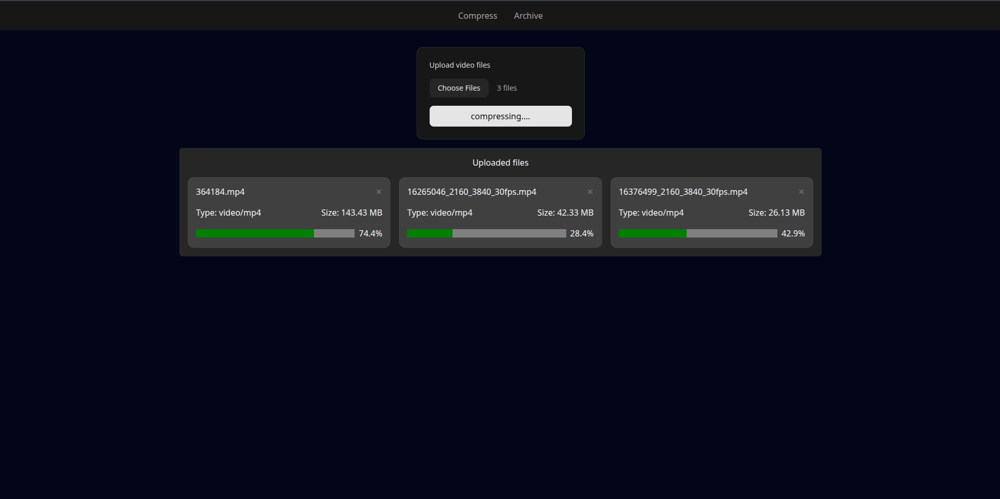
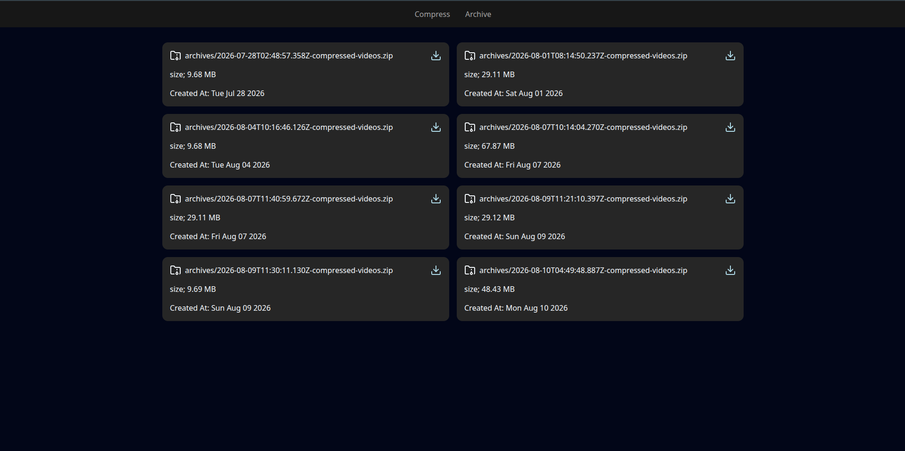

# Compressio: Video Compressing Tool
This is a full stack web app built using React and Express. The main functionality of this app is to compress multiple videos at once and return a zip that contains the compressed videos. Users can download this zip file. User also get the see the real-time progress of compress operation of each videos. After compression is completed zip file is permanently stored in s3 bucket.

## Key Features
- **video compressing**: compress video of multiple formats like (.mp4, .mov etc ) using ffmpeg
- **Real time progress**: displays a progress bar showing compression progress using server sent events (SSE).
- **Convert to zip**: when the compression is completed, all videos are archived in a zip file
- **Download zip**: as soon vidoe compressing completed users can download the zip file.
- **Saved in s3 Bucket**:zip files are stored  in s3 Buckets, users can see all the archives and download them from s3 bucket.

## Tech Stack
- **Frontend**: React, axios, tailwindcss
- **Backend**: aws-sdk, archiver, express, multer, fluent-ffmpeg
- **storage**: AWS s3 bucket
- **Deployment**: AWS, Github Action, Docker, EC2 instance

## Screenshots

